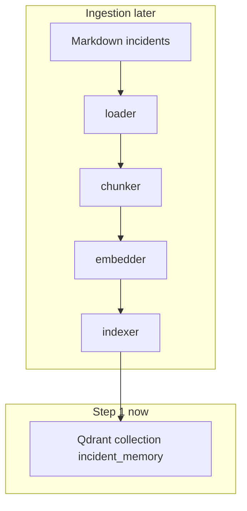

# Incident Memory

RAG lab: given a production error snippet, retrieve similar historical incidents.

We build it **one layer at a time**. Current stop: **Step 8 — retrieval evaluation**.

## Architecture (target)



## Step 1 — What a vector database is

Qdrant stores **points**. Each point later will be:

- `id`
- `vector` (a list of floats from an embedding model)
- `payload` (JSON metadata: incident id, service, severity, chunk text)

A **collection** is a named vector space with a fixed size and distance metric. We create `incident_memory` now, empty:

- size **384** — matches `all-MiniLM-L6-v2` in Step 4. Wrong size later = insert errors.
- distance **Cosine** — MiniLM cares about *direction* of meaning, not vector length. Cosine is not a probability.

**ANN / HNSW (high level):** Qdrant does not compare your query to every stored vector once you have many points. It walks a graph of neighbors (HNSW) and returns *approximately* the nearest ones. Fast enough to matter at millions of points; our 20 docs would be fine with brute force. We still use Qdrant so the production shape is visible.

We are **not** embedding or searching yet. Step 1 only proves: Docker Qdrant is up, Python can create the collection.

## Setup and test

Docker must be running (Docker Desktop or similar).

```bash
cd OpsSense   # this repo
docker compose up -d
python3 -m venv .venv && source .venv/bin/activate
pip install -r requirements.txt
python scripts/setup_qdrant.py
pytest tests/test_qdrant_setup.py -v
```

Success looks like: `Qdrant reachable`, collection Cosine size 384, pytest passed.

Dashboard: http://localhost:6333/dashboard

## Step 2 — Document loading

Raw markdown is not a search record. The loader (`src/ingestion/loader.py`) reads `data/incidents/*.md` and returns a **normalized dict**:

```json
{
  "incident_id": "INC-2841",
  "title": "Aerospike Timeout During Peak Traffic",
  "service": "fraud",
  "severity": "SEV1",
  "content": "..."
}
```

**Why preprocess.** Files have headings, blank lines, and human labels (`Fraud Detection` vs `fraud`). Retrieval later needs stable keys for filters and a single `content` string to chunk.

**Why metadata is separate from the body.** `service` and `severity` are exact fields for Qdrant payload filters (Step 7). If you only stuffed them into the embedded text, a query could not reliably say “only SEV1 fraud.” The body still contains those words for semantic search; metadata is the structured copy.

**Why similar incidents.** Several docs mention Aerospike timeouts, payment latency, and pool exhaustion with *different* root causes. That makes retrieval non-trivial later.

Qdrant is unused this step.

```bash
source .venv/bin/activate
python scripts/load_documents.py
pytest tests/test_loader.py -v
```

Expect ~19 documents and parsed `INC-2841` with `service: fraud`.

## Step 3 — Chunking

An embedding model turns **one string** into **one vector**. If that string is a whole postmortem, Aerospike timeouts get averaged with “added Grafana dashboards.” The query then matches a blur.

**Chunk size** here is a count of whitespace-separated words (a stand-in for tokens, not MiniLM’s tokenizer). Default **500** with **100 overlap**.

**Overlap** repeats the tail of chunk *n* at the start of chunk *n+1* so a sentence split on a boundary still exists intact in at least one chunk. Step is `chunk_size - overlap` (400 words).

- **Too small:** fragments with no complete thought; more chunks; more noise in top-k.
- **Too large:** mixed topics in one vector; the query can hit the wrong half of the doc.

Every chunk copies metadata:

```json
{
  "chunk_id": "INC-2841:2",
  "incident_id": "INC-2841",
  "service": "fraud",
  "severity": "SEV1",
  "chunk_index": 2,
  "text": "..."
}
```

Our sample incidents are short, so default 500 often yields **one chunk per file**. The demo script uses size 40 so you can see overlap.

```bash
source .venv/bin/activate
python scripts/chunk_documents.py
pytest tests/test_chunker.py -v
```

## Step 4 — Embeddings

An **embedding** is a list of floats (here **384** dimensions). The model maps text into a space where paraphrases land nearby even if they share few keywords.

`all-MiniLM-L6-v2` via `sentence-transformers`. API:

- `embed(text) -> vector`
- `embed_batch(texts) -> vectors`

We set `normalize_embeddings=True`, so **cosine similarity** equals **dot product**. **Euclidean** distance would care about vector length; we do not use it. Qdrant’s collection (Step 1) already uses **Cosine** for the same reason.

A cosine of `0.8` is **not** “80% chance this is the RCA.” It only means “closer than 0.2 in this space.”

Experiment: two ops phrases vs sports — keyword overlap is weak on the first pair, semantic closeness should still win.

```bash
source .venv/bin/activate
pip install -r requirements.txt
python scripts/embedding_similarity.py
pytest tests/test_embedder.py -v
```

First run downloads the model. Qdrant is unused this step.

## Step 5 — Store embeddings in Qdrant

A vector database stores three things per **point**:

1. `id` — UUID derived from `chunk_id`
2. `vector` — 384 floats from MiniLM
3. `payload` — JSON for display and later filters (not used in the distance calculation)

```json
{
  "incident_id": "INC-2841",
  "service": "fraud",
  "severity": "SEV1",
  "title": "Aerospike Timeout During Peak Traffic",
  "chunk_index": 0,
  "text": "..."
}
```

Flow: load markdown → chunk → `embed_batch` → `upsert`. Recreate the collection so reruns stay consistent.

Qdrant indexes the vectors (HNSW) so later search does not scan every point. We still do not query in this step — only write.

```bash
source .venv/bin/activate
docker compose up -d
python scripts/index_documents.py
pytest tests/test_indexer.py -v
```

Expect `points_count` equal to the number of chunks (about 19 with default 500-word windows). Dashboard: http://localhost:6333/dashboard

## Step 6 — Vector search

```
query → MiniLM → query vector → Qdrant ANN (cosine) → top_k chunks
```

`search(query, top_k=5)` embeds the query with the **same** model used at index time (different model = garbage neighbors). Qdrant returns the nearest stored vectors. Each hit is `score`, `incident_id`, `title`, `service`, `severity`, `text`.

**Score** is cosine similarity in this collection (higher = closer direction). It is **not** a probability and not “confidence this is the RCA.” Rank order matters more than the absolute number. Near-miss incidents can still score high because the corpus is small and thematically overlapping.

Requires Step 5 data already in `incident_memory`.

```bash
source .venv/bin/activate
python scripts/search.py "Fraud feature lookups are timing out because Aerospike is responding slowly."
pytest tests/test_vector_search.py -v
```

Expect INC-2841 / INC-1923 / similar Aerospike-fraud incidents near the top.

## Step 7 — Metadata filtering

**Semantic search** ranks by meaning. A payments Redis timeout can still sit next to an Aerospike fraud incident.

**Metadata filtering** is an exact match on payload (`service`, `severity`) *with* ANN. Qdrant only considers points that satisfy `must` conditions, then ranks those by cosine.

```python
search("Aerospike timeout", top_k=5, filters={"service": "fraud", "severity": "SEV1"})
```

Use filters when the operator already knows the service or SEV. Do not use them to express “sounds like fraud” — that is the vector’s job.

```bash
source .venv/bin/activate
python scripts/search.py "Aerospike timeout"
python scripts/search.py "Aerospike timeout" --filter service=fraud --filter severity=SEV1
pytest tests/test_vector_search.py -v
```

Unfiltered top-k can include `payments` / `sessions`. Filtered results should all be `fraud` `SEV1` (e.g. INC-2841, INC-1407, INC-1744).

## Step 8 — Retrieval evaluation

Gold file: [`tests/eval/queries.json`](tests/eval/queries.json) — 10 queries, each with labeled relevant incident IDs.

Hits are **chunks**. We collapse to unique `incident_id`s in rank order, then:

**Recall@k** = (gold IDs that appear in the top-k unique incidents) / (number of gold IDs), averaged over queries.

Compare chunk sizes **200 / 500 / 1000** with overlap = 20% of size. Re-index into `incident_memory_eval` so the Step 5 collection is left alone.

Chunk size changes whether a distinctive sentence sits in a clean vector or is diluted (or split). There is no universally best size; this table is the measurement.

```bash
source .venv/bin/activate
python scripts/eval_chunking.py
pytest tests/test_eval_metrics.py -v
```

The script prints a table (`chunk`, `overlap`, `n` chunks, `R@3`, `R@5`). First run reloads MiniLM and indexes three times.

Stop here. Step 9 is keyword / BM25 search.
