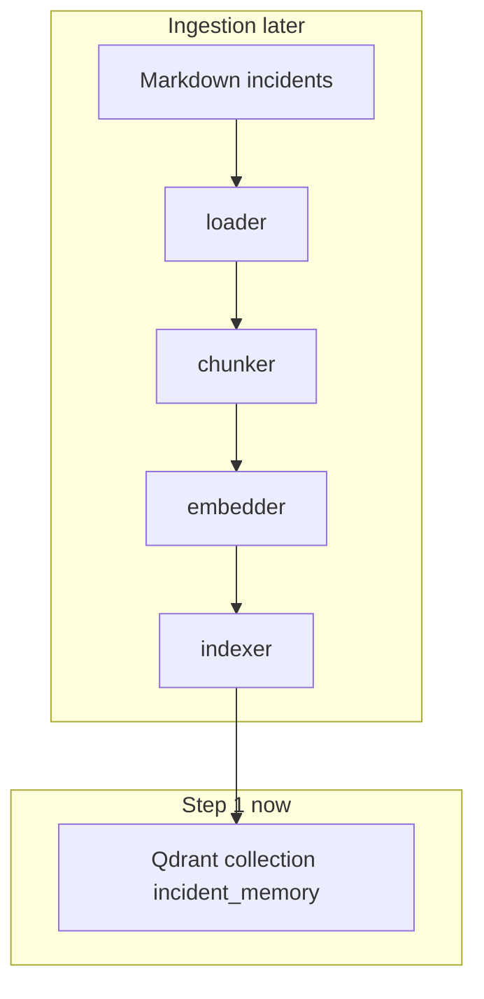

# Incident Memory

RAG lab: given a production error snippet, retrieve similar historical incidents.

We build it **one layer at a time**. Current stop: **Step 1 — Qdrant**.

## Architecture (target)



## Step 1 — What a vector database is

Qdrant stores **points**. Each point later will be:

- `id`
- `vector` (a list of floats from an embedding model)
- `payload` (JSON metadata: incident id, service, severity, chunk text)

A **collection** is a named vector space with a fixed size and distance metric. We create `incident_memory` now, empty:

- size **384** — matches `all-MiniLM-L6-v2` in Step 4. Wrong size later = insert errors.
- distance **Cosine** — MiniLM cares about *direction* of meaning, not vector length. Cosine is not a probability.

**ANN / HNSW (high level):** Qdrant does not compare your query to every stored vector once you have many points. It walks a graph of neighbors (HNSW) and returns *approximately* the nearest ones. Fast enough to matter at millions of points; our 20 docs would be fine with brute force. We still use Qdrant so the production shape is visible.

We are **not** embedding or searching yet. Step 1 only proves: Docker Qdrant is up, Python can create the collection.

## Setup and test

Docker must be running (Docker Desktop or similar).

```bash
cd OpsSense   # this repo
docker compose up -d
python3 -m venv .venv && source .venv/bin/activate
pip install -r requirements.txt
python scripts/setup_qdrant.py
pytest tests/test_qdrant_setup.py -v
```

Success looks like: `Qdrant reachable`, collection Cosine size 384, pytest passed.

Dashboard: http://localhost:6333/dashboard

Stop here. Step 2 is loading markdown incidents.
