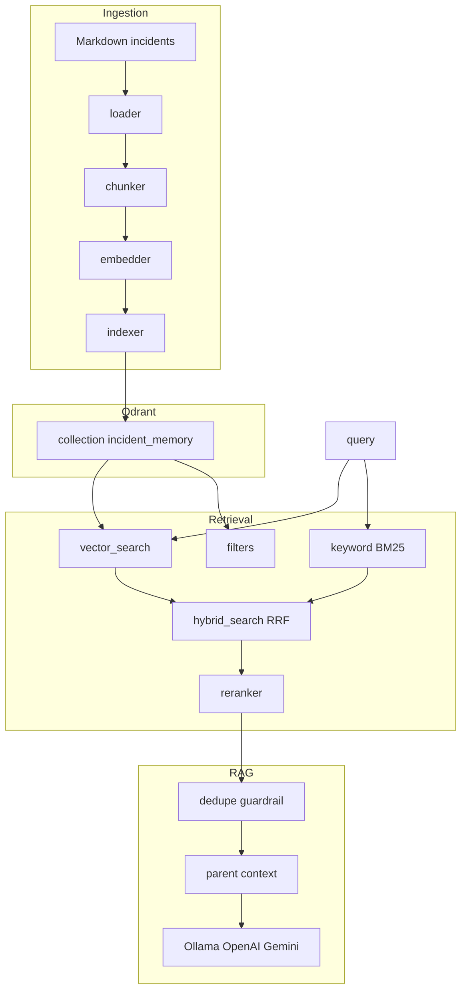

# Architecture

## Module map

| Module | Role |
| --- | --- |
| [`src/settings.py`](../src/settings.py) | Pydantic settings (env validation) |
| [`src/deps.py`](../src/deps.py) | Cached Qdrant client, embedder, BM25 index, reranker |
| [`src/ingestion/loader.py`](../src/ingestion/loader.py) | Parse incident markdown metadata |
| [`src/ingestion/chunker.py`](../src/ingestion/chunker.py) | Section-aware chunking |
| [`src/ingestion/indexer.py`](../src/ingestion/indexer.py) | Embed + upsert to Qdrant |
| [`src/retrieval/vector_search.py`](../src/retrieval/vector_search.py) | Cosine ANN |
| [`src/retrieval/keyword_search.py`](../src/retrieval/keyword_search.py) | In-process BM25 |
| [`src/retrieval/hybrid_search.py`](../src/retrieval/hybrid_search.py) | RRF fusion |
| [`src/retrieval/reranker.py`](../src/retrieval/reranker.py) | Cross-encoder rerank |
| [`src/rag/generator.py`](../src/rag/generator.py) | Structured JSON answers |
| [`src/api/main.py`](../src/api/main.py) | HTTP API |

## API

| Endpoint | Description |
| --- | --- |
| `GET /health` | Qdrant status, point count, embedding model |
| `POST /index` | `{recreate?: bool}` — upsert chunks (default upsert only) |
| `POST /search` | `{query, top_k, mode, filters?, score_threshold?}` |
| `POST /ask` | Structured JSON: `similar_incidents`, `hypotheses`, `sources` |

## Configuration

See [`.env.example`](../.env.example). Important flags:

- `RERANK_ENABLED` — cross-encoder rerank after RRF (default `true`; set `false` in CI/tests)
- `RETRIEVAL_MIN_SCORE` — skip LLM when best hit score is below threshold
- `EMBEDDING_MODEL` — vector dimension derived from model at runtime
